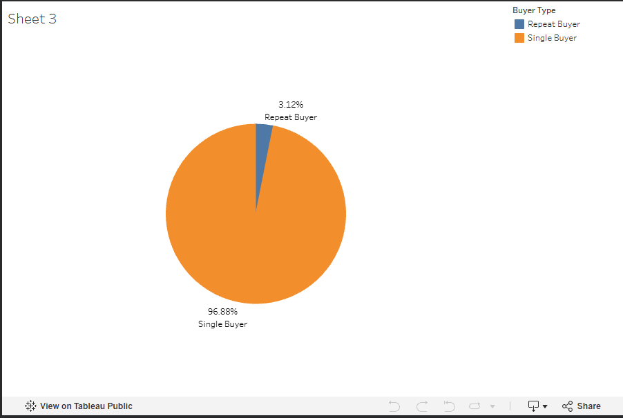
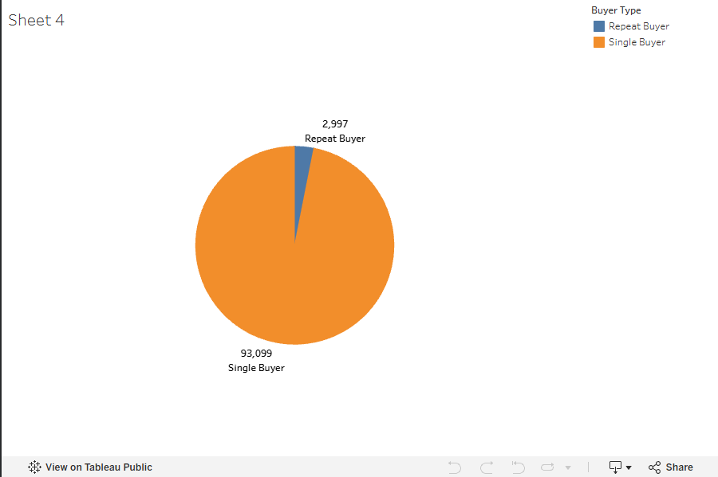
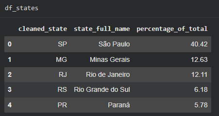

# Brazilian E-Commerce Case Study

An exploratory data analysis project using the Olist Brazilian E-Commerce dataset, built with **SQL (Google BigQuery)** and visualized in **Tableau Public**. The goal is to clean a messy real-world dataset, uncover business-relevant trends, and translate the findings into actionable recommendations.

## Project Goal

Starting from a raw, unclean e-commerce dataset, this project:
1. Loads the data into BigQuery and explores the table schemas
2. Cleans and analyzes the data using SQL (cleaning happens inline with analysis, since this project uses BigQuery's sandbox tier)
3. Surfaces trends that could inform real business decisions
4. Visualizes the results in Tableau to make them easy to communicate to stakeholders

## Tools Used

- **Google BigQuery** — data storage and SQL analysis
- **SQL** — CTEs, window functions, joins, and conditional logic (`CASE`, `OVER`, `INNER JOIN`)
- **Google Colab** — notebook environment and documentation
- **Tableau Public** — data visualization

## Analysis Breakdown

### 1. Orders by State
Cleans and standardizes state abbreviations from the `Olist_Geolocation` table, then calculates each state's share of total order volume using a CTE combined with a window function (`SUM() OVER()`). This identifies which regions generate the most orders — useful for prioritizing marketing spend.

**Key finding:** São Paulo leads by a wide margin at 40.42% of total orders, followed by Minas Gerais (12.63%), Rio de Janeiro (12.11%), Rio Grande do Sul (6.18%), and Paraná (5.78%).

### 2. Customer Purchase Frequency
Joins the `Olist_Order_Dataset` and `Olist_Customers` tables on `customer_id`, then counts distinct purchases per `customer_unique_id` (not `customer_id`, since a new `customer_id` is generated per order — using the wrong column would make every customer look like a one-time buyer).

**Key finding:** 96.88% of customers (93,099) made only a single purchase, while just 3.12% (2,997) came back for a repeat purchase — a strong signal of weak customer loyalty. The project recommends a loyalty program and further outreach to the small repeat-buyer segment to understand what's driving their retention.

## Visualizations

Interactive Tableau dashboards are embedded directly in the notebook:
- [Items Bought — Sheet 3](https://public.tableau.com/views/Book3_Items_Bought/Sheet3)
- [Items Bought — Sheet 4](https://public.tableau.com/views/Book3_Items_Bought_2/Sheet4)

Screenshots for a quick preview without opening the notebook:

## How This Notebook Is Written

Each SQL query is broken down clause by clause with plain-language explanations of what each part does and why — not just the final query and its output. This makes it easier to follow the reasoning behind each analytical decision, not just the result.

## Notes on Scope

This analysis intentionally focuses on two clear, high-impact trends rather than covering every possible angle in the dataset. The reasoning: a handful of well-explained, actionable findings is more useful to stakeholders than a sprawling analysis that's hard to act on.

## Files

- `Brazilian__Case_Study.ipynb` — full notebook with SQL queries, step-by-step explanations, and embedded visualizations

## Author

Built as part of a data analytics portfolio to demonstrate SQL querying, data cleaning, and business-focused data storytelling.
