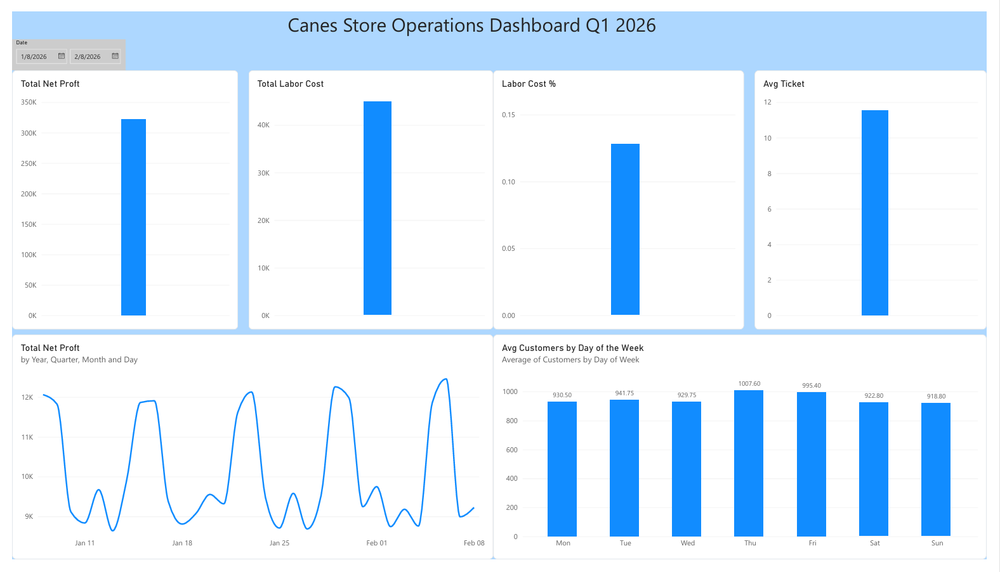
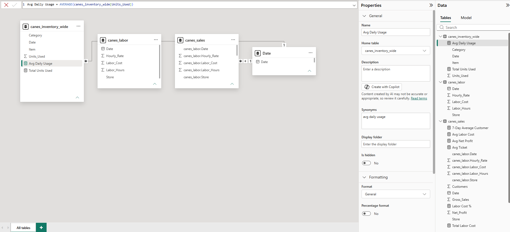
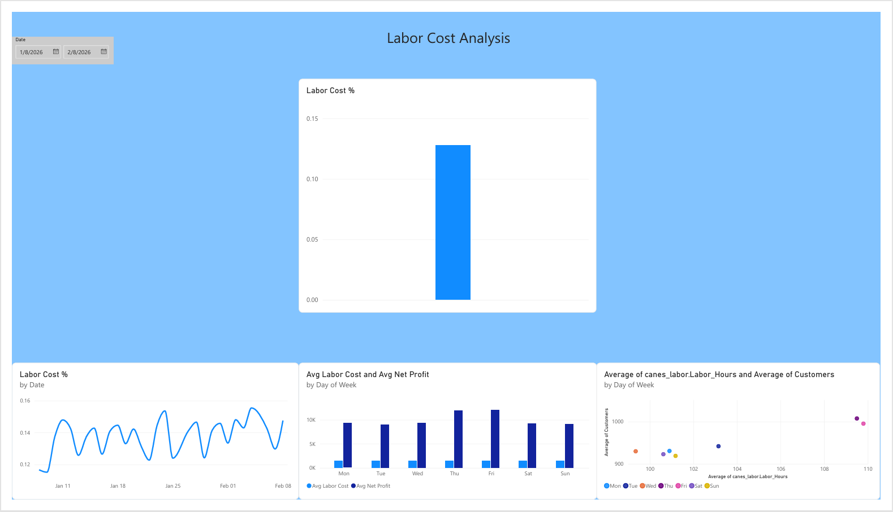
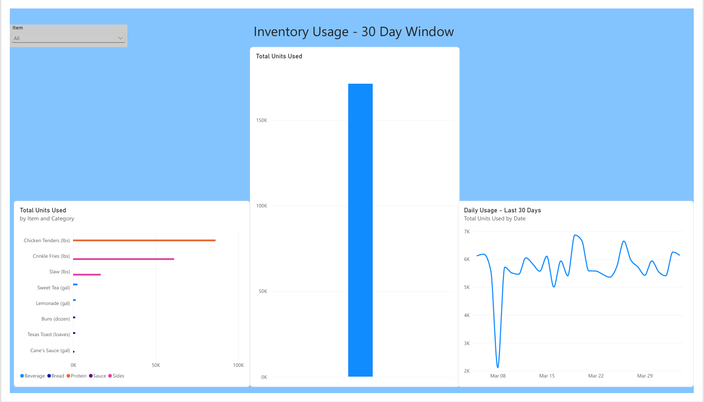

# Cane's Operations Dashboard

A Power BI dashboard analyzing sales trends, labor cost, and inventory usage for a quick-service restaurant location — built to demonstrate data modeling, Power Query transformation, and DAX measure development using patterns from real restaurant management experience.



## About the Data

The dataset is simulated across a 3-month window (91 days), but the customer counts, labor hours, and profit ranges are modeled directly on real operating patterns from a Raising Cane's location — including the weekly rhythm where Thursday and Friday consistently outperform the rest of the week. Inventory usage covers a 30-day rolling window across 8 core menu items.

## Data Model

Three source tables — Sales, Labor, and Inventory — were cleaned and merged in Power Query, then connected to a shared Date dimension table in a star schema:

- **Sales + Labor** were merged on Date after standardizing inconsistent date formats and store-name formatting between the two source files
- **Inventory** started as a wide table (one column per date) and was reshaped using Power Query's Unpivot transformation into a proper long table
- A dedicated **Date table** (built with `List.Dates` in Power Query, marked as an official Date Table) powers all time-based filtering and the time-intelligence DAX measure below



## Key DAX Measures

```
Labor Cost % = DIVIDE(SUM(canes_sales[Labor_Cost]), SUM(canes_sales[Gross_Sales]))

7-Day Avg Customers =
CALCULATE(
    AVERAGE(canes_sales[Customers]),
    DATESINPERIOD('Date'[Date], MAX('Date'[Date]), -7, DAY)
)
```

`Labor Cost %` is the headline operational metric — the ratio of labor spend to sales that any restaurant manager tracks daily. The 7-day rolling average measure uses `CALCULATE` and `DATESINPERIOD` to show a smoothed trend line rather than noisy day-to-day swings.

## Report Pages

**Overview** — KPI cards (Net Profit, Labor Cost %, Avg Ticket), a 3-month trend line, a weekday performance comparison, and an interactive date range slicer.



**Labor Cost** — Labor Cost % trend over time, a scatter chart comparing labor hours against customer volume by weekday, and a side-by-side comparison of labor cost vs. net profit across the week.



**Inventory** — Usage totals by menu item, categorized by type (protein, bread, sides, sauce, beverage), with a filterable daily usage trend for any selected item.

## Key Insight

Thursday and Friday post measurably higher customer counts and net profit, but the labor-hours scatter chart shows staffing is scheduled in fixed weekly tiers rather than dynamically matched to same-day demand — pointing to a real opportunity to tighten labor cost % by scheduling closer to forecasted volume instead of a fixed template.

## Tools

Power BI Desktop — Power Query (merge, unpivot, data type correction), Data Modeling (star schema, relationships), DAX (aggregation, ratio, and time-intelligence measures)
